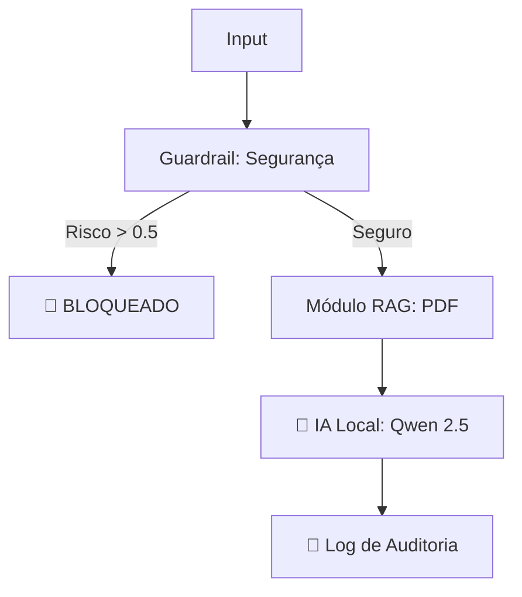

# 🛠️ PromptOps-Engine: Governança Local de LLMs

Este framework gerencia a segurança e o custo de IAs locais.

## 🎯 Arquitetura

## 🚀 Como Rodar
1. Instale as dependências: `pip install -r requirements.txt`
2. Execute o core: `python core.py`
