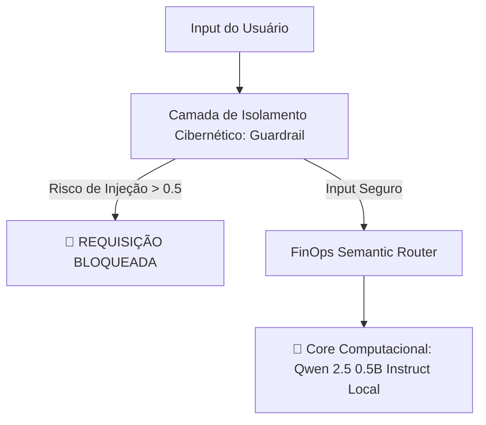

# 🛠️ PromptOps-Engine: Framework Enterprise para Orquestração e Governança Local de LLMs

Este repositório contém a implementação de um pipeline de **PromptOps** corporativo de nível sênior. O framework roda modelos open-source locais sem dependência de chaves de APIs proprietárias.

## 🎯 Arquitetura de Produção e Fluxo de Dados

### 🛡️ 1. Camada de Isolamento e Segurança (AI Guardrails)
*   **Mecanismo:** Filtro determinístico integrado a um analisador semântico estruturado em JSON.
*   **Proteção:** Bloqueio em tempo real contra técnicas de *Prompt Injection*, vazamento de *System Prompts* originais e *jailbreaks*.

### 💰 2. Roteamento Inteligente (FinOps Optimization)
*   **Mecanismo:** Roteador semântico para tomada de decisão de infraestrutura.
*   **Impacto:** Direciona cargas de trabalho para instâncias edge locais com custo zero de tokens, otimizando o ROI do projeto.

## ⚙️ Stack Tecnológico
*   **Core:** Python 3.10+
*   **Engine Executiva:** Hugging Face `transformers` & `accelerate`
*   **Modelos Utilizados:** `Qwen/Qwen2.5-0.5B-Instruct` (Execução 100% local)
*   **Tipagem:** `typing.Dict`, `typing.Any`
